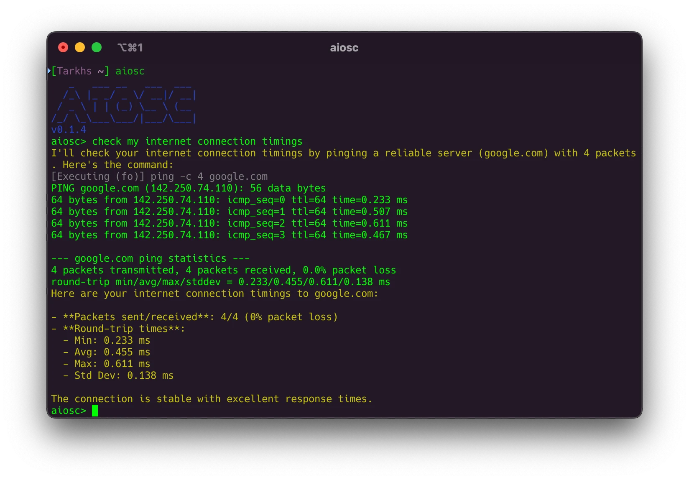

# AIOSC - Artificial Intelligence Operating System Commander

<p align="center">
  
</p>

<p align="center">
  <a href="https://github.com/tarkh/aiosc/releases"></a>
  <a href="https://github.com/tarkh/aiosc/blob/main/LICENSE"></a>
</p>

## Overview

AIOSC (Artificial Intelligence Operating System Commander) is a powerful CLI tool that brings AI-driven automation to your operating system. By interpreting natural language commands, AIOSC simplifies system management, executes tasks intelligently, and provides a seamless interface between you and your OS.

Whether you're automating repetitive tasks, querying system status, or exploring your OS with natural language, AIOSC is your intelligent assistant at the command line.

## Features

- **Natural Language Processing**: Execute commands using everyday language (e.g., "check my ping" or "create a directory test").
- **Task Automation**: Chain multiple steps into a single command for efficient workflows.
- **Safe Execution**: Configurable confirmation prompts and safeguards for dangerous commands.
- **Interactive & Scriptable**: Use interactively with a REPL or inline for scripting/cron jobs.
- **Customizable**: Define custom commands and tweak behavior via config or flags.
- **Cross-Platform**: Supports Bash, Zsh, Cmd, and PowerShell shells.

## Installation

1. **Download**: Grab the latest binary from the [Releases](https://github.com/tarkh/aiosc/releases) page.
2. **Place**: Move it to a directory in your `PATH` (e.g., `/usr/local/bin` on Unix, or a custom dir on Windows).
3. **Configure**: Create `aiosc.config.json` (see [Configuration](#configuration) below) or use environment variables.

## Usage

### Interactive Mode
```bash
aiosc
```
- Launches the REPL with a banner and prompt (`aiosc>`).
- Type natural language commands or built-ins (e.g., `help`, `exit`).

### Inline Mode
```bash
aiosc check my ping
```
- Executes the command and exits when complete.

#### Flags
- `--no-confirm`: Skips confirmation prompts for automation (use "force" or "override" for dangerous commands).
- `--silent`: Outputs only the final AI response (ideal for scripting).

**Examples:**
```bash
aiosc --no-confirm analyze my ping timings
# Output: Full execution trace

aiosc --no-confirm --silent create dir test and list it
# Output: Final directory list
```

## Configuration

### Config File Locations
AIOSC loads `aiosc.config.json` from:
1. **User Config Dir**:
   - Linux: `~/.config/aiosc/aiosc.config.json`
   - macOS: `~/Library/Application Support/aiosc/aiosc.config.json`
   - Windows: `%APPDATA%\aiosc\aiosc.config.json`
2. **Binary Dir**: `./aiosc.config.json` (next to the executable).

If absent, AIOSC creates a default config in the user config dir.

### Settings
| Key                     | Type    | Default                            | Description                                      |
|-------------------------|---------|------------------------------------|--------------------------------------------------|
| `debug`                 | bool    | `false`                            | Logs LLM requests/responses for debugging.       |
| `api_addr`              | string  | `"https://openrouter.ai/api/v1"`   | AI model server API endpoint.                    |
| `api_key`               | string  | `""`                               | API key for the server (required).               |
| `model`                 | string  | `"qwen/qwen-2.5-coder-32b-instruct:free"` | AI model identifier.                    |
| `show_ai_commands_output` | bool  | `true`                             | Shows command output in interactive mode.        |
| `context_window_size`   | usize   | `32`                               | Max number of messages in chat history.          |
| `shell_type`            | string  | `"bash"`                           | Shell to use (`bash`, `zsh`, `cmd`, `powershell`). |
| `require_confirmation`  | bool    | `true`                             | Prompts before executing commands (overridden by `--no-confirm`). |
| `cooldown`              | u64     | `0`                                | Seconds to wait between commands if no confirmation. |
| `max_iterations`        | usize   | `16`                               | Max steps to prevent infinite loops.             |
| `references`            | array   | `[]`                               | Custom command definitions (optional).           |

### Example Config
`aiosc.config.json`:
```json
{
  "debug": false,
  "api_addr": "https://openrouter.ai/api/v1",
  "api_key": "your-api-key",
  "model": "qwen/qwen-2.5-coder-32b-instruct:free",
  "show_ai_commands_output": true,
  "context_window_size": 32,
  "shell_type": "bash",
  "require_confirmation": true,
  "cooldown": 1,
  "max_iterations": 16,
  "references": [
    {
      "command": "<cmdctx>my-custom-app --restart <name></cmdctx>",
      "description": "Restart MyCustomApp by name."
    }
  ]
}
```

### Environment Variables
Override config settings with:
```bash
AIOSC_DEBUG
AIOSC_API_ADDR
AIOSC_API_KEY
AIOSC_MODEL
AIOSC_SHOW_AI_COMMANDS_OUTPUT
AIOSC_CONTEXT_WINDOW_SIZE
AIOSC_SHELL_TYPE
AIOSC_REQUIRE_CONFIRMATION
AIOSC_COOLDOWN
AIOSC_MAX_ITERATIONS
```

Example:
```bash
bash
export AIOSC_API_KEY="your-key"
export AIOSC_MODEL="deepseek/deepseek-chat-v3-0324:free"
aiosc
```

## Supported LLM Servers
- [OpenRouter AI](https://openrouter.ai)
- [LM Studio](https://lmstudio.ai)

## Tested AI Models
- `deepseek/deepseek-chat-v3-0324:free` (OpenRouter AI)
- `qwen/qwen-2.5-coder-32b-instruct:free` (OpenRouter AI)
- `meta-llama/llama-3.2-3b-instruct:free` (OpenRouter AI, may generate excessive commands)
- `qwen2.5-coder-7b-instruct` (LM Studio)

## Safety Features
- **Confirmation**: Prompts for risky commands unless `--no-confirm` is used.
- **Dangerous Command Block**: Blocks commands like `rm -rf` without "force" or "override" in `--no-confirm` mode.
- **Iteration Limit**: Caps execution steps at `max_iterations` (default: 16) to prevent infinite loops.

## Development Status
AIOSC is actively developed. Expect new features and improvements!

## Contributing
Contributions are welcome! Feel free to:
- Open issues for bugs or feature requests.
- Submit pull requests to enhance functionality.
- Join the discussion on [Telegram](https://t.me/tarkhx).

Fork the repo, make changes, and submit a PR—let's build something great together!

## License
Licensed under the [MIT License](LICENSE).

## Author
Created by [tarkh](https://t.me/tarkhx). Reach out with feedback or ideas!